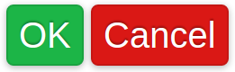

# button



```　html
<style type="text/css">
     /* basic button style */
    .btn {
        font-size: 125%;
        line-height: 1.5;
        background: #328014;
        border: 1px solid rgba(0, 0, 0, .1);
        border-radius: .2em;
        color: white;
        box-shadow: 0 .05em .25em rgba(0, 0, 0, .3);
        text-shadow: 0 -.05em .05em rgba(0, 0, 0, .3);
    }

    .btn.ok {
        background-color: #1cb547;// overide background-color
    }

    .btn.cancel {
        background-color: #da1815;
    }
</style>
<button class="btn ok">OK</button>
<button class="btn cancel">Cancel</button>
```