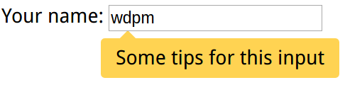

# callout



``` html
<style>
        .callout {
            width: 12em;
            height: 2em;
            margin-left: 5em;
            margin-top: .35em;
            position: relative;
            background: #ffd352;
            border-radius: .2em;
            text-align: center;
            line-height: 2;
        }

        .callout:before {
            content: "";
            z-index: -1; /*reduces its z-index*/
            position: absolute;
            background: inherit;
            border: inherit;
            top: -.25em;
            left: 1em;
            padding: .35em;
            border-right: 0;
            border-bottom: 0;
            transform: rotate(45deg);
        }
</style>

<label>Your name:
    <input type="text" name="name" value="wdpm"/>
</label>
<div class="callout">Some tips for this input</div>
```
