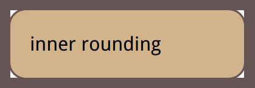

# inner-rounding



``` html
<style>
    div{
        outline: .6em solid #655;
        box-shadow: 0 0 0 .1em #655; /* .1em */

        max-width: 10em;
        border-radius: .8em;
        padding: 1em;
        margin: 1em;
        background: tan;
        font: 100%/1.5 sans-serif;
    }
</style>

<div>inner rounding</div>
```

### How to cover the the empty area?


> (&radic;2 -1)* r <= expand radius <= outline width

(&radic;2 -1)* 0.8em <= 0.4em <= 0.6em

``` css
    outline: .6em solid #655;
    box-shadow: 0 0 0 .4em #655;
    border-radius: .8em;
```
