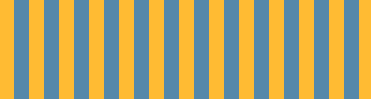
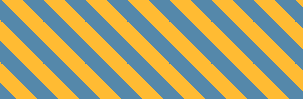

# stripes

## horizontal-stripes


```
0----------------------------------------
-----------------------------------------
-----------------------------------------
33.3%------------------------------------#fb3 #58a (key point)
-----------------------------------------
-----------------------------------------
-----------------------------------------
66.6%------------------------------------#58a yellowgreen (key point)
-----------------------------------------
-----------------------------------------
-----------------------------------------
100%-------------------------------------
```
``` html
<style>
    div {
        width: auto;
        height: 100px;
        background: linear-gradient(#fb3 33.3%,
        #58a 33.3%, #58a 66.6%, yellowgreen 66.6%);/* gradient　direction:　to bottom */
        background-size: 100% 45px;
    }
</style>

<div></div>
```

## vertical-stripes


``` html
background: linear-gradient(to right, #fb3 50%, #58a 50%);
background-size: 30px 100%;
```

## diagonal-stripes


``` html
background: linear-gradient(45deg, #fb3 25%, #58a 0,
                                    #58a 50%, #fb3 0,
                                    #fb3 75%, #58a 0);
background-size: 42px 42px;
```
## diagonal-stripes-60deg


``` html
background: repeating-linear-gradient(60deg, #fb3, #fb3 15px, #58a 0, #58a 30px);
```

## subtle-stripes


``` html
background: #58a;
background-image: repeating-linear-gradient(30deg,
hsla(0, 0%, 100%, .2),
hsla(0, 0%, 100%, .2) 15px,
transparent 0, transparent 30px);
```
