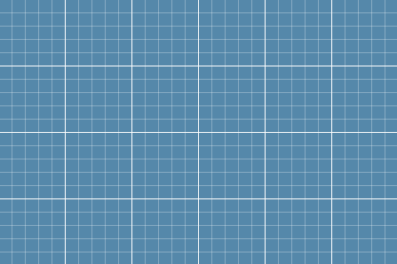

# gridding


``` html
<style>
    div {
        width: auto;
        height: 300px;
        background: #58a;
        background-image:
            linear-gradient(white 1px, transparent 0),
            linear-gradient(90deg, white 1px, transparent 0),
            linear-gradient(hsla(200, 0%, 100%, .3) 1px, transparent 0),
            linear-gradient(90deg, hsla(200, 0%, 100%, .3) 1px, transparent 0);
        background-size: 75px 75px, 75px 75px, 15px 15px, 15px 15px;
    }
</style>

<div></div>
```