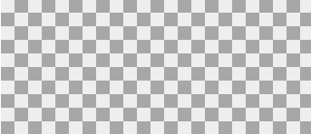

# checkerboard


``` html
<style>
    div {
        width: auto;
        height: 150px;
        background: #eee;
        background-image:
        linear-gradient(45deg,
            rgba(0, 0, 0, .3) 25%, transparent 0,
            transparent 75%, rgba(0, 0, 0, .3) 0),
        linear-gradient(45deg,
            rgba(0, 0, 0, .3) 25%, transparent 0,
            transparent 75%, rgba(0, 0, 0, .3) 0);
        background-size: 30px 30px;
        background-position: 0 0, 15px 15px;
    }
</style>

<div></div>
```
The Code above is a little difficult to understand, the below is more easy to understand
``` html
<style>
    div {
        width: auto;
        height: 150px;
        background: #eee;
        background-image:
            linear-gradient(45deg, rgba(0, 0, 0, .3) 25%, transparent 0),
            linear-gradient(45deg, transparent 75%, rgba(0, 0, 0, .3) 0),
            linear-gradient(45deg, rgba(0, 0, 0, .3) 25%, transparent 0),
            linear-gradient(45deg, transparent 75%, rgba(0, 0, 0, .3) 0);
        background-size: 30px 30px;
        background-position: 0 0, 15px 15px,
                            15px 15px, 30px 30px;
    }
</style>

<div></div>
```