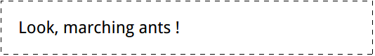

# marching-ants


``` html
<style>
    @keyframes ants {
        to {
            background-position: 100% 100%
        }
    }

    div {
        max-width: 20em;
        max-height: 10em;
        background: #eee;
        padding: 1em;
        border: 1px solid transparent;
        background: linear-gradient(white, white) padding-box,/* clip background to padding box*/
        repeating-linear-gradient(-45deg, black 0%, black 25%, transparent 25%, transparent 50%) 0 / .6em .6em;
        animation: ants 12s linear infinite;
    }

</style>

<div>Look, marching ants !</div>
```