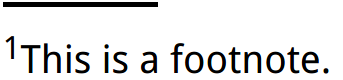

# footnote


``` html
<style>
    .footnote {
        border-top: .15em solid transparent;
        /*border-image-slice: number|%|fill;*/
        border-image: 100% 0 0 linear-gradient(90deg, currentColor 4em, transparent 0);
        padding-top: .5em;
        font: 220%/1.4 Baskerville, Palatino, serif;
    }

</style>

<div class="footnote"><sup>1</sup>This is a footnote.</div>
```