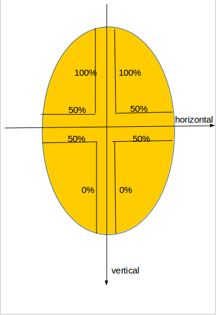

# half-ellipse




``` html
<style>
    div {
        background: #ffc94c;
        width: 150px;
        height: 200px;
        border-radius: 50% 50% 50% 50% / 100% 100% 0 0;/* 50% / 100% 100% 0 0 */
    }
</style>

<div></div>
```