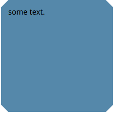

# bevel-corners-gradients


``` html
<style>
    p {
        height: 100px;
        width: 200px;
        background: #58a;
        background:
            linear-gradient(135deg, transparent 15px, #58a 0) top left,
            linear-gradient(-135deg, transparent 15px, #58a 0) top right,
            linear-gradient(-45deg, transparent 15px, #58a 0) bottom right,
            linear-gradient(45deg, transparent 15px, #58a 0) bottom left;
        background-size: 51% 51%;/* 50% will cause white line bug on chrome*/
        background-repeat: no-repeat;
        padding: .5em;
    }
</style>

<p>Some text.</p>
```

# bevel-corners


``` html
<style>
    div {
        width: 200px;
        height: 200px;
        border: 15px solid transparent;
        border-image: 1 url('data:image/svg+xml,\
        <svg xmlns="http://www.w3.org/2000/svg" width= "3" height= "3" fill= "%2358a" >\
        <polygon points= "0,1 1,0 2,0 3,1 3,2 2,3 1,3 0,2" />\
        </svg> ');
        background: #58a;
        background-clip: padding-box;
    }
</style>

<div>some text.</div>
```