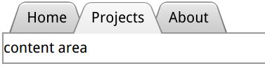

# trapezoid-tabs

> only view, NO click listeners.


``` html
<style>
    body {
        padding: 40px;
        font: 130%/2 Frutiger LT Std, sans-serif;
    }

    nav {
        position: relative;
        z-index: 1;
        padding-left: 1em;
    }

    nav > a {
        position: relative;
        display: inline-block;
        padding: .3em 1em 0;
        color: inherit;
        text-decoration: none;
        margin: 0 -.3em;
    }

    nav > a::before,
    main {
        border: .1em solid rgba(0,0,0,.4);
    }

    nav a::before {
        content: ''; /* To generate the box */
        position: absolute;
        top: 0; right: 0; bottom: 0; left: 0;
        z-index: -1;
        border-bottom: none;
        border-radius: .5em .5em 0 0;
        background: #ccc linear-gradient(hsla(0,0%,100%,.6), hsla(0,0%,100%,0));
        box-shadow: 0 .15em white inset;
        transform: scale(1.1, 1.3) perspective(.5em) rotateX(5deg);
        transform-origin: bottom;
    }

    nav a.selected { z-index: 2;}

    nav a.selected::before {
        background-color: #eee;
        margin-bottom: -.08em;
    }
</style>

<nav>
    <a href="#">Home</a>
    <a href="#" class="selected">Projects</a>
    <a href="#">About</a>
</nav>
<main>
    content area.
</main>
```