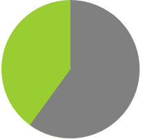

# pie-static

## transform


``` html
<style>
    @keyframes spin {
        to {
            transform: rotate(.5turn)
        }
    }

    @keyframes bg {
        50% {
            background: grey;
        }
    }

    .pie {
        position: relative;
        width: 200px;
        line-height: 200px;
        border-radius: 50%;
        background: yellowgreen;
        background-image: linear-gradient(to right, transparent 50%, grey 0);
        color: transparent;
        text-align: center;
    }

    .pie::before {
        content: "";
        position: absolute;
        display: block;
        top: 0;
        left: 50%;
        height: 100%;
        width: 50%;
        border-radius: 0 100% 100% 0/ 50%; /* make pseudo to be a half circle*/
        background-color: inherit;
        transform-origin: left;/* 0 50% */
        animation: spin 50s linear infinite,
        bg 100s step-end infinite;
        animation-play-state: paused;
        animation-delay: inherit;
    }

</style>

<div class="pie" style="animation-delay: -60s">60%</div>
```
## svg
``` html
<style>
    @keyframes fill-up {
        to {
            stroke-dasharray: 100 100;
        }
    }

    circle {
        fill: yellowgreen;
        stroke: #655;
        stroke-width: 32;
        /*stroke-dasharray: 0 100;*/
        /*animation: fill-up 5s linear infinite;*/
    }

    svg {
        width: 100px;
        height: 100px;
        transform: rotate(-90deg);
        background: yellowgreen; /* fill background*/
        border-radius: 50%;
    }

</style>

<div class="pie">20%</div>

<script>
    function $$(selector, context) {
        context = context || document;
        var elements = context.querySelectorAll(selector);
        return Array.prototype.slice.call(elements);
    }

    $$('.pie').forEach(function (pie) {
        var p = parseFloat(pie.textContent);
        var NS = "http://www.w3.org/2000/svg";
        var svg = document.createElementNS(NS, "svg");
        var circle = document.createElementNS(NS, "circle");
        var title = document.createElementNS(NS, "title");
        circle.setAttribute("r", 16);
        circle.setAttribute("cx", 16);
        circle.setAttribute("cy", 16);
        circle.setAttribute("stroke-dasharray", p + " 100");
        svg.setAttribute("viewBox", "0 0 32 32");
        title.textContent = pie.textContent;
        pie.textContent = '';
        svg.appendChild(title);
        svg.appendChild(circle);
        pie.appendChild(svg);
    });
</script>
```
