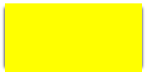

#  shadow

## shadow-one-side

``` html
<style>
    .shadow-one-side{
        width: 200px;
        height:100px;
        background: yellow;
        box-shadow: 0 6px 4px -4px black;/* first 4px -4px, then caculate 0 6 px*/
    }
</style>

<div class="shadow-one-side"></div>
```

## shadow-2-sides

``` html
<style>
    .shadow-2-sides {
        width: 200px;
        height: 100px;
        background: yellow;
        box-shadow: 3px 3px 6px -3px black;
    }
</style>

<div class="shadow-2-sides"></div>
```

## shadow-opposite-sides

``` html
<style>
    .shadow-opposite-sides {
        width: 200px;
        height: 100px;
        background: yellow;
        box-shadow: -6px 0 6px -6px black,
                     6px 0 6px -6px black;
    }
</style>

<div class="shadow-opposite-sides"></div>
```

