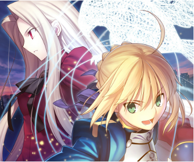
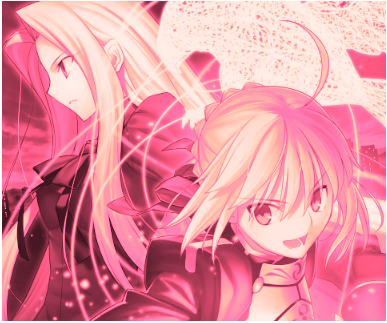

# color-tint-filter
> Not full supported



``` html
<style>
    img {
        width: 384px;
        height: 320px;
        transition: filter 5s;
        filter: sepia(1) saturate(4) hue-rotate(295deg);
    }

    img:hover,
    img:focus {
        filter: none;
    }
</style>


```