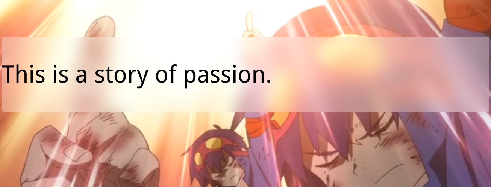

# frosted-glass


``` html
<style>
    body, main::before {
        background: url("23-frosted-glass/simen.png") 0 / cover fixed;
    }

    main {
        position: relative;
        margin-top: 100px;
        background: hsla(0, 0%, 100%, .3);
        border-radius: 5px;
        overflow: hidden;
        width: auto;
        font-size: 400%;
        line-height: 200px;
    }

    main::before {
        content: '';
        position: absolute;
        top: 0;
        right: 0;
        bottom: 0;
        left: 0;
        z-index: -1;
        filter: blur(20px);
        margin: -30px;
    }
</style>
<body>
<main>This is a story of passion.</main>
</body>
```
