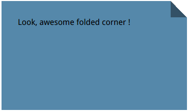
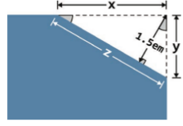
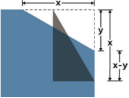
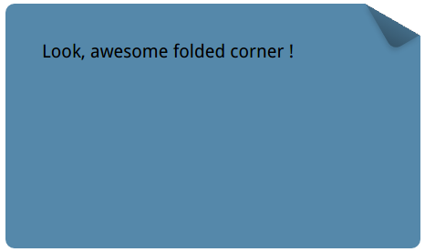

# folded-corner



``` html
<style>
    div {
        width: 300px;
        height: 150px;
        background: #58a;
        background: linear-gradient(to left bottom,
        transparent 50%, rgba(0, 0, 0, .4) 0) no-repeat 100% 0 / 2em 2em,
        linear-gradient(-135deg, transparent 1.42em, #58a 0); /* 2/(sqrt(2)) ≈ 1.414 213 562 */
        padding: 2em;
    }
</style>
<div>Look, awesome folded corner !</div>
```

> Question: What happen if corner degree is not 45deg? How about 30deg or 60deg?

# folded-corner-realistic





> the pictures above are from \<<css secret\>>.
``` html
<style>
    .note {
        position: relative;
        width: 300px;
        height: 150px;
        background: #58a;
        background: linear-gradient(-150deg, transparent 1.5em, #58a 0);
        padding: 2em;
        border-radius: .5em;
    }

    .note::before {
        content: '';
        position: absolute;
        top: 0;
        right: 0;
        background: linear-gradient(to left bottom,
        transparent 50%, rgba(0, 0, 0, .2) 0, rgba(0, 0, 0, .4)) no-repeat 100% 0;
        width: 1.73em;
        height: 3em;
        transform: translateY(-1.3em) rotate(-30deg);
        transform-origin: bottom right;
        border-bottom-left-radius: inherit;
        box-shadow: -.2em .2em .3em -.1em rgba(0, 0, 0, .2);
    }
</style>
<div class="note">Look, awesome folded corner !</div>
```
> [folder-corner.scss](./folder-corner.scss)
