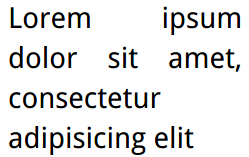

# hypenation

> must specify style in html tag


``` html
<html>
<style>
    html {
        width: 8.7em;
        font: 180%/1.4 Baskerville, serif;
        text-align: justify;
        hyphens: auto;
    }
</style>

<body>
<p>Lorem ipsum dolor sit amet, consectetur adipisicing elit</p>
</body>
</html>
```