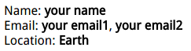

# line-breaks


``` html
<style>
    dt, dd {
        display: inline;
    }

    dd {
        margin: 0;
        font-weight: bold;
    }

    dd + dt::before {
        content: '\A';
        white-space: pre; /* avoid browser merge white-space character '\000A'*/
    }

    dd + dd::before {
        content: ', ';
        margin-left: -.25em;
        font-weight: normal;/* todo: doesn't work? why?*/
    }

</style>
<dl>
    <dt>Name:</dt>
    <dd>your name</dd>

    <dt>Email:</dt>
    <dd>your email1</dd>
    <dd>your email2</dd>

    <dt>Location:</dt>
    <dd>Earth</dd>
</dl>
```