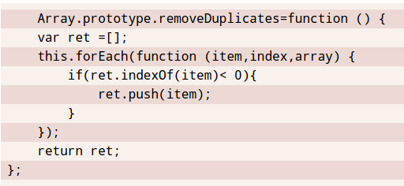

# zebra-lines



``` html
<style>
    pre {
        padding: .5em;
        line-height: 1.5em;
        background: hsl(20, 50%, 95%);
        background-image: linear-gradient(
                rgba(120, 0, 0, .1) 50%, transparent 0);
        background-size: auto 3em; /* 2* line-height */
        background-origin: content-box; /* default is padding-box*/
        font-family: Consolas, Monaco, monospace;
    }
</style>
<pre>
    Array.prototype.removeDuplicates=function () {
    var ret =[];
    this.forEach(function (item,index,array) {
        if(ret.indexOf(item)< 0){
            ret.push(item);
        }
    });
    return ret;
};
</pre>
```