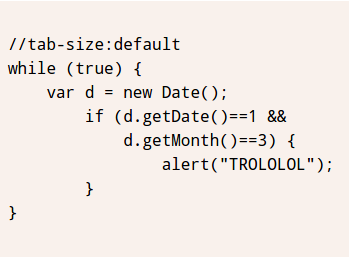
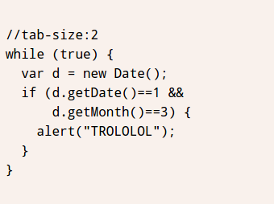

# tab-size



``` html
<style>
    pre {
        padding: .5em;
        line-height: 1.5;
        background: hsl(20, 50%, 95%);
        font-family: Consolas, Monaco, monospace;
    }

    pre:nth-of-type(2) {
        tab-size: 2
    }

    code {
        font: inherit;
    }
</style>
<pre>
    <code>
    Array.prototype.removeDuplicates=function () {
        var ret =[];
        this.forEach(function (item,index,array) {
            if(ret.indexOf(item)< 0){
                ret.push(item);
        }
        });
        return ret;
    };
    </code>
</pre>
<pre>
    <code>
    Array.prototype.removeDuplicates=function () {
        var ret =[];
        this.forEach(function (item,index,array) {
            if(ret.indexOf(item)< 0){
                ret.push(item);
        }
        });
        return ret;
    };
    </code>
</pre>
```