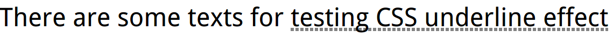

# underlines


``` html
<style>
    .underline {
        background: linear-gradient(90deg,
        gray 66%, transparent 0) repeat-x;
        background-size: .2em 2px;
        background-position: 0 1em;
    }
</style>
<p>There are some texts for <span class="underline">testing CSS underline effect</span></p>
```

# How to implement wavy underlines?
> tips: two layers with gradients.
// todo