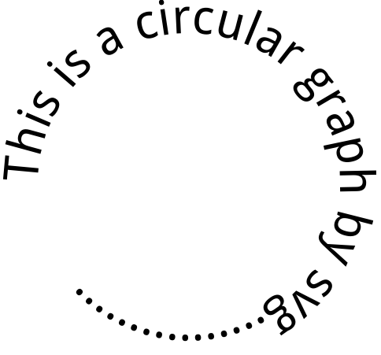

# circular-text


``` html
<style>
    .circular {
        width: 30em;
        height: 30em;
    }

    .circular path {
        fill: none;
    }

    .circular svg {
        display: block;
        overflow: visible;
        margin: 3em 3em 0 3em;
    }
</style>

<div class="circular">
    <svg viewBox="0 0 100 100">
        <path d="M 0,50 a 50,50 0 1,1 0,1 z"
              id="circle"></path>
        <text>
            <textPath xlink:href="#circle">
                This is a circular graph by svg................
            </textPath>
        </text>
    </svg>
</div>
```

- helper function
``` js
<script>
    $$('.circular').forEach(function (el) {
        var NS = "http://www.w3.org/2000/svg";
        var xlinkNS = "http://www.w3.org/1999/xlink";
        var svg = document.createElementNS(NS, "svg");
        var circle = document.createElementNS(NS, "path");
        var text = document.createElementNS(NS, "text");
        var textPath = document.createElementNS(NS, "textPath");
        svg.setAttribute("viewBox", "0 0 100 100");
        circle.setAttribute("d", "M0,50 a50,50 0 1,1 0,1z");
        circle.setAttribute("id", "circle");
        textPath.textContent = el.textContent;
        textPath.setAttributeNS(xlinkNS, "xlink:href", "#circle");
        text.appendChild(textPath);
        svg.appendChild(circle);
        svg.appendChild(text);
        el.textContent = '';
        el.appendChild(svg);
    });
</script>
```
