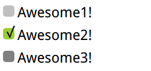

# checkboxes


``` html
<style>
    body {
        font: 150%/1.6 sans-serif;
    }

    /* hide original checkbox */
    input[type="checkbox"] {
        position: absolute;
        clip: rect(0, 0, 0, 0);
    }

    input[type="checkbox"] + label::before {
        content: '\a0'; /* Do not wrap spaces */
        display: inline-block;
        vertical-align: .2em;
        width: .8em;
        height: .8em;
        margin-right: .2em;
        border-radius: .2em;
        background: silver;
        line-height: .65;
    }

    input[type="checkbox"]:checked + label::before {
        content: '\2713';
        background: yellowgreen;
    }

    input[type="checkbox"]:focus + label::before {
        box-shadow: 0 0 .1em .1em #58a;
    }

    input[type="checkbox"]:disabled + label::before {
        background: gray;
        box-shadow: none;
        color: #555;
        cursor: not-allowed;

    }
</style>
<input type="checkbox" id="awesome"/>
<label for="awesome">Awesome1!</label>
<br>
<input type="checkbox" id="awesome2" checked/>
<label for="awesome2">Awesome2!</label>
<br>
<input type="checkbox" id="awesome3" disabled/>
<label for="awesome3">Awesome3!</label>
```
