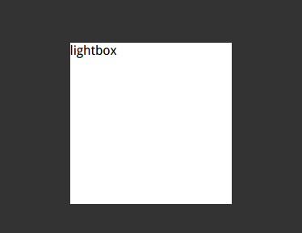
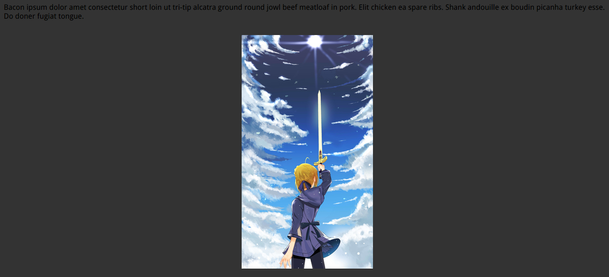
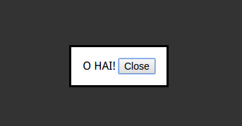

# weaken-background-by-shadow

## pseudo-element


``` html
    body.dimmed::before {
        position: fixed;
        top: 0;
        right: 0;
        bottom: 0;
        left: 0;
        z-index: 1;
        background: rgba(0, 0, 0, .8);
    }
```
Disadvantages:
- need to add dimmed class to ``<body>`` by JavaScript.
- pseudo element can't bind JavaScript event handler.

## dimming-box-shadow


``` html
<style>
    .lightbox {
        position: fixed;
        top: 50%;
        left: 50%;
        margin-left: -140px;
        margin-top: -250px;
        box-shadow: 0 0 0 50vmax rgba(0, 0, 0, .8); /* 50vmax * 2 =full screen */
    }
</style>


<p>Bacon ipsum dolor amet consectetur...</p>
```
Disadvantages:
- need to add `` position: fixed;``,otherwise the edges of the mask layer will be exposed when scrolling.
- only play a guiding role in the visual attention, but can not prevent mouse interaction.

## backdrop


``` html
<style>
    dialog::backdrop {
        background: rgba(0, 0, 0, .8);
    }
</style>

<button id="show">Click me</button>
<dialog id="modal">
    O HAI!
    <button id="close">Close</button>
</dialog>

<script>
    var showBtn = document.getElementById('show');
    var closeBtn = document.getElementById('close');
    showBtn.onclick = function () {
        document.querySelector('#modal').showModal();
    };
    closeBtn.onclick = function () {
        this.parentNode.close();
    }
</script>
```
Disadvantages:
- browser limited supported.

