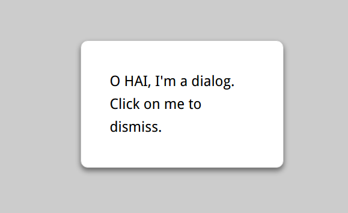

# weaken-background-by-blur


``` html
<style>
    main {
        transition: .6s;
        background: white;
    }

    main.de-emphasized {
        -webkit-filter: blur(3px);
        filter: blur(3px);
    }

    dialog {
        position: fixed;
        top: 50%;
        left: 50%;
        z-index: 1;
        width: 10em;
        padding: 2em;
        margin: -5em;
        border: 1px solid silver;
        border-radius: .5em;
        box-shadow: 0 .2em .5em rgba(0, 0, 0, .5),
        0 0 0 100vmax rgba(0, 0, 0, .2);
    }

    dialog:not([open]) {
        display: none;
    }

    body {
        font: 150%/1.6 Baskerville, Palatino, serif;
    }
</style>

<body>
<dialog>O HAI, I'm a dialog. Click on me to dismiss.</dialog>
<main class="">
    <button>Show dialog</button>
    <p>Bacon ipsum dolor sit amet consectetur...</p>
</main>
<script>
    function $(sel) {
        return document.querySelector(sel);
    }
    var button = $('button');
    var dialog = $('dialog');
    var main = $('main');
    button.onclick = function () {
        dialog.setAttribute('open', '');
        /* set open attribute can make dialog open.*/
        main.classList.add('de-emphasized');
    };
    dialog.onclick = function () {
        if (dialog.close) {
            dialog.close();
        } else {
            dialog.removeAttribute('open');
        }
        main.classList.remove('de-emphasized');
    }
</script>
</body>
```
