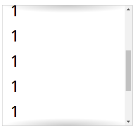

# scrolling-hints


``` html
<style>
    ul {
        overflow: auto;
        width: 10em;
        height: 8em;
        padding: .3em .5em;
        border: 1px solid silver;
        /* todo */
        background: linear-gradient(white 30%, hsla(0, 0%, 0%, 0)),
        radial-gradient(at 50% 0, rgba(0, 0, 0, .8), transparent 70%),
        radial-gradient(at 50% 100%, rgba(0, 0, 0, .8), transparent 70%) 0 100%,
        linear-gradient(white 30%, hsla(0, 0%, 0%, 0)) 0 100%;
        background-repeat: no-repeat;
        background-size: 100% 50px, 100% 15px, 100% 15px, 100% 50px;
        background-attachment: local, scroll, local, scroll;
    }
</style>
<ul>
    <li>1/li>
    <li>2/li>
    <li>3/li>
    <li>4/li>
    <li>5/li>
    <li>6/li>
    <li>7/li>
    <li>8</li>
    <li>9/li>
    <li>10/li>
    <li>11/li>
    <li>12/li>
</ul>
```
