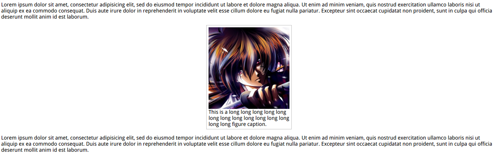

# intrinsic-sizing



``min-content``:The width of the largest unbreakable element (ie, the widest word, picture, or box with a fixed width）
``` html
<style>
    figure {
        max-width: 300px; /*for graceful degradation*/
        max-width: min-content;
        margin: auto;
    }

    figure > img {
        max-width: inherit; /* if max-width: min-content, this line will be ignored.*/
    }

    /* Basic styling */

    figure {
        padding: 10px;
        border: 1px solid silver;
    }
</style>

<p>..Omitted..</p>
<figure>
    
    <figcaption>
        This is a long long long long long long long long long long long long long long figure caption.
    </figcaption>
</figure>
<p>..Omitted..</p>

```
