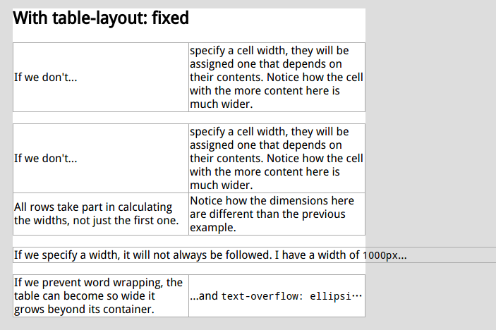

# table-column-widths


``` html
<style>
    body {
        background: #ddd
    }

    section {
        width: 500px;
        margin: 2em;
        background: white;
    }

    table {
        border-collapse: collapse;
        margin-bottom: 1em;
        width: 100%;
    }

    section table {
        table-layout: fixed
    }

    td {
        border: 1px solid #aaa;
    }

    td.preformatted {
        white-space: pre;
        font-family: sans-serif, Monaco, monospace;
        text-overflow: ellipsis;
        overflow: hidden;
    }
</style>

<section>
    <h1>With table-layout: fixed</h1>
    <div>
        <table>
            <tbody>
            <tr>
                <td>If we don't...</td>
                <td>specify a cell width, they will be assigned one that depends on their contents. Notice how the cell
                    with the more content here is much wider.
                </td>
            </tr>
            </tbody>
        </table>
    </div>
    ...
</section>
```
