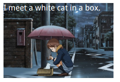

# state-animations


``` html
<style>
    @keyframes panoramic {
        to {
            background-position: 0 100%;
        }
    }

    .panoramic {
        color: white;
        width: 220px;
        height: 150px;
        background: url("./path/to/night-and-cat.jpeg");
        background-size: 100% auto;
        animation: panoramic 10s linear infinite alternate;
        animation-play-state: paused;
    }

    .panoramic:hover, .panoramic:focus {
        animation-play-state: running;
    }
</style>
<body>
<div class="panoramic">I meet a white cat in a box.</div>
</body>
```