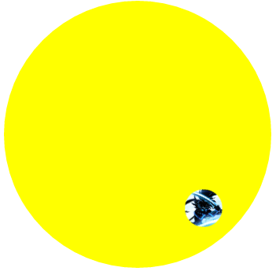

# circular



### circular-2elements
``` html
<style>
    @keyframes spin {
        to {
            transform: rotate(1turn);
        }

    }

    .avatar {
        animation: spin 6s infinite linear;
        transform-origin: 50% 150px; /* 150px = the radius of path */
    }

    .avatar > img {
        animation: inherit;
        animation-direction: reverse;
    }

    /*below is just styling*/
    .avatar {
        width: 48px;
        margin: 0 auto;
        border-radius: 50%;
        overflow: hidden;
    }

    .avatar > img {
        display: block;
        width: inherit;
    }

    .path {
        width: 300px;
        height: 300px;
        padding: 20px;
        border-radius: 50%;
        background: yellow;
    }

</style>
<body>
<div class="path">
    <div class="avatar">
        
    </div>
</div>
</body>
```
### circular
``` html
<style>

    @keyframes spin {
        from {
            transform: rotate(0turn) translateY(-150px) translateY(50%) rotate(1turn)
        }
        to {
            transform: rotate(1turn) translateY(-150px) translateY(50%) rotate(0turn);
        }
    }

    .avatar {
        animation: spin 6s infinite linear;
    }

    /* Anything below this is just styling */

    .path {
        width: 300px;
        height: 300px;
        padding: 20px;
        margin: 100px auto;
        border-radius: 50%;
        background: #fb3;
    }

    .avatar {
        display: block;
        width: 50px;
        margin: calc(50% - 25px) auto 0;
        border-radius: 50%;
        overflow: hidden;
    }

    .avatar > img {
        width: inherit;
    }

</style>
<body>
<div class="path">
    <div class="avatar">
        
    </div>
</div>
</body>
```